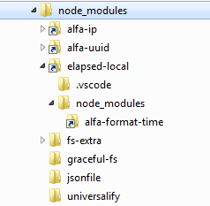

# copy-with-symlinks

If you have **symbolic links** in your `node_modules`, 
and run `npm instal` or `gulp-install` task, this will create new `node_modules` folder for production with broken symbolic links. (not tested on linux or darwin)

`copy-with-symlinks` utility will copy all folders from `sourceRoot/dirName` to `destinationRoot/dirName` with actual folders instead of symbolic links. 
```javascript
copyWithSymlinks(sourceRoot, destinationRoot, dirName, options, cb);
```

NOTE:  
The `destinationRoot/dirName` folder MUST NOT exist before this operation. This folder will be created. Otherwise strange things will happen to symlinks on Windows. (not tested on linux or darwin)

Symbolic links are great for private modules, but npm should handle it for production release.

To check if you have symbolic links in node_modules, look for little link arrows on the folder icon in file explorer:  


## gulp use example
### NOTE:
The `copy-with-symlinks` only copies  existing folders form DEV `node_modules` to BUILD. Run `npm install` in DEV before, to make sure that your modules are in order.

```javascript
const gulp = require('gulp');
const copyWithSymlinks = require('copy-with-symlinks');

var dest = 'BUILD';

function cb(){console.log('done.');}

gulp.task('copy-npm-modules', function(cb){

     copyWithSymlinks(
        './',                           // sourceRoot
        dest,                           // destinationRoot
        'node_modules',                 // dirName
        {
            quiet: false,               // print copied files to console
            noDevDependencies: true     // do not copy devDependencies (form package.json)
        }, 
        cb                              // callback for gulp task
    );

});
```

## gulp - remove useless files and folders from `node_modules`

try **[gulp-dmn](https://www.npmjs.com/package/gulp-dmn)**

### advanced example - one task to copy and purge `node_modules`
```javascript
const gulp = require('gulp');
const copyWithSymlinks = require('copy-with-symlinks');
const gulpDmn = require('gulp-dmn');

var dest = 'BUILD';

function cb(){console.log('done.');}

gulp.task('copy-npm-modules', function(cb){

     copyWithSymlinks('./', dest, 'node_modules', {quiet: false, noDevDependencies: true}, function(){
         gulpDmn(dest, {dryRun: false, list: false}, cb);
     });

});
```


## todo
*This utility is synchronous (slow) for now. (Maybe if future I'll make it async)*